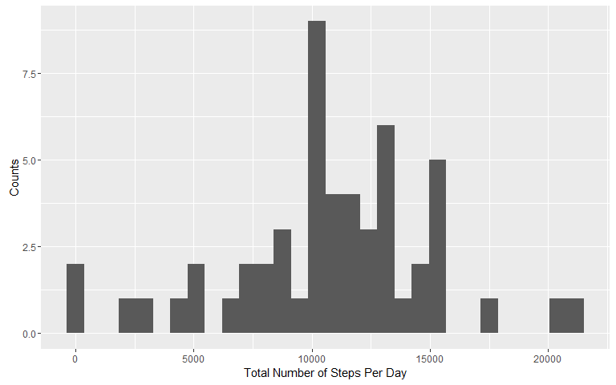
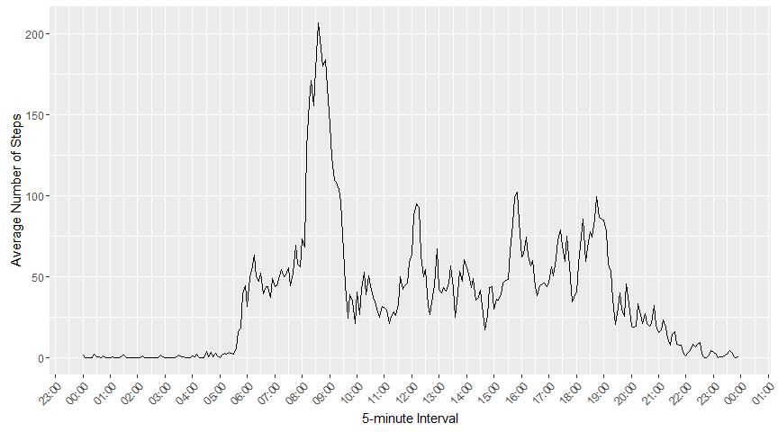
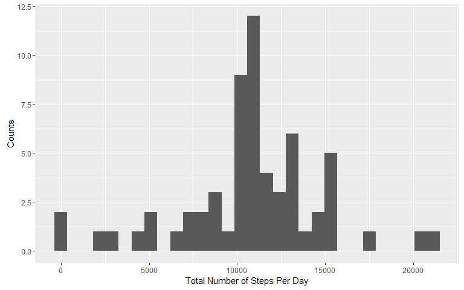
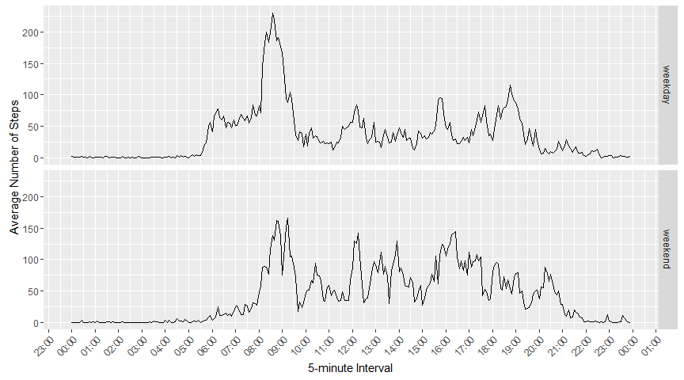

# Reproducible Research: Peer Assessment 1

## Loading and preprocessing the data
First of all, unpack **activity.zip** to get the data **activity.csv**.  
And load **activity.csv** into **data**.

```r
unzip("./activity.zip")
data <- read.csv("./activity.csv")
```
And transform interval into time format

```r
data$interval <- paste(data$interval%/%100,data$interval%%100,sep=":")
data$datetime <- strptime(paste(data$date,data$interval),format="%Y-%m-%d %H:%M")
head(data)
```

```
##   steps       date interval            datetime
## 1    NA 2012-10-01      0:0 2012-10-01 00:00:00
## 2    NA 2012-10-01      0:5 2012-10-01 00:05:00
## 3    NA 2012-10-01     0:10 2012-10-01 00:10:00
## 4    NA 2012-10-01     0:15 2012-10-01 00:15:00
## 5    NA 2012-10-01     0:20 2012-10-01 00:20:00
## 6    NA 2012-10-01     0:25 2012-10-01 00:25:00
```
In addition, because we will need use time axises, I must change location for language of date.

```r
Sys.setlocale(category = "LC_ALL", locale = "English_United States.1252")
```

```
## [1] "LC_COLLATE=English_United States.1252;LC_CTYPE=English_United States.1252;LC_MONETARY=English_United States.1252;LC_NUMERIC=C;LC_TIME=English_United States.1252"
```

## What is mean total number of steps taken per day?
Create a dataframe to present summation of steps grouped by date.

```r
sumStepsPerDate <- aggregate(steps~date,data=data,FUN=sum,na.rm=TRUE)
colnames(sumStepsPerDate)[colnames(sumStepsPerDate)=="steps"] <- "steps_sum"
head(sumStepsPerDate)
```

```
##         date steps_sum
## 1 2012-10-02       126
## 2 2012-10-03     11352
## 3 2012-10-04     12116
## 4 2012-10-05     13294
## 5 2012-10-06     15420
## 6 2012-10-07     11015
```
Plot a histogram of **sumStepsPerDate** by ggplot.

```r
library(ggplot2)
figure1 <- ggplot(data=sumStepsPerDate, aes(steps_sum)) +
    geom_histogram(bins=30) +
    labs(x="Total Number of Steps Per Day",y="Counts")
### Could be add mean and median vline
#    + geom_vline(aes(xintercept=mean(steps_sum),color="Mean"), linetype="dashed", size=0.5, show.legend=TRUE) +
#    geom_vline(aes(xintercept=median(steps_sum),color="Median"), linetype="dashed", size=0.5, show.legend=TRUE) +
#    scale_colour_manual(values=c(Mean="red",Median="blue"))

print(figure1)
```

<!-- -->
  
In this histogram, mean total number of steps taken per day is

```r
mean(sumStepsPerDate$steps_sum)
```

```
## [1] 10766.19
```
And median total number of steps taken per day is

```r
median(sumStepsPerDate$steps_sum)
```

```
## [1] 10765
```
## What is the average daily activity pattern?
To identify the average daily activity pattern, we make a time series plot of the 5-minute interval (x-axis) and the average number of steps taken, averaged across all days (y-axis).

```r
aveStepsPerInterval <- aggregate(steps~interval,data=data,FUN=mean,na.rm=TRUE)
colnames(aveStepsPerInterval)[colnames(aveStepsPerInterval)=="steps"] <- "steps_ave"
head(aveStepsPerInterval)
```

```
##   interval steps_ave
## 1      0:0 1.7169811
## 2     0:10 0.1320755
## 3     0:15 0.1509434
## 4     0:20 0.0754717
## 5     0:25 2.0943396
## 6     0:30 0.5283019
```

```r
figure2 <- ggplot(data=aveStepsPerInterval, aes(strptime(interval,format="%H:%M",tz="GMT"),steps_ave)) +
    geom_line() +
    theme(axis.text.x = element_text(angle=45,hjust=1)) +
    labs(x="5-minute Interval",y="Average Number of Steps") +
    scale_x_datetime(date_breaks="1 hour", date_labels="%H:%M")
print(figure2)
```

<!-- -->
  
On average across all the days in the dataset, 5-minute interval that contains the maximum number of steps is

```r
aveStepsPerInterval$interval[ aveStepsPerInterval$steps_ave == max(aveStepsPerInterval$steps_ave) ]
```

```
## [1] "8:35"
```

## Imputing missing values
Note that there are a number of days/intervals where there are missing values (coded as NA). The presence of missing days may introduce bias into some calculations or summaries of the data.  

The total number of missing values in the dataset (i.e. the total number of rows with NAs) is

```r
sum(is.na(data$steps))
```

```
## [1] 2304
```
This is not a small number. We could use some strategy for filling in all of the missing values in the dataset. The strategy does not need to be sophisticated. For example, you could use the mean/median for that day, or the mean for that 5-minute interval, etc. Here, I use the mean for that 5-minute interval to fill all missing values, and save new data to **newData**

```r
newData <- data
missDataInterval <- newData$interval[is.na(newData$steps)]
getSteps_ave<-function(interval){
    return(aveStepsPerInterval[aveStepsPerInterval$interval==interval,]$steps_ave)
}
newData$steps[is.na(newData$steps)] <- mapply(getSteps_ave, missDataInterval)
head(newData)
```

```
##       steps       date interval            datetime
## 1 1.7169811 2012-10-01      0:0 2012-10-01 00:00:00
## 2 0.3396226 2012-10-01      0:5 2012-10-01 00:05:00
## 3 0.1320755 2012-10-01     0:10 2012-10-01 00:10:00
## 4 0.1509434 2012-10-01     0:15 2012-10-01 00:15:00
## 5 0.0754717 2012-10-01     0:20 2012-10-01 00:20:00
## 6 2.0943396 2012-10-01     0:25 2012-10-01 00:25:00
```
And then, we make a histogram of the total number of steps taken each day in this **newData** like the first part of the assignment.

```r
newSumStepsPerDate <- aggregate(steps~date,data=newData,FUN=sum,na.rm=TRUE)
colnames(newSumStepsPerDate)[colnames(newSumStepsPerDate)=="steps"] <- "steps_sum"
figure3 <- ggplot(data=newSumStepsPerDate, aes(steps_sum)) +
    geom_histogram(bins=30) +
    labs(x="Total Number of Steps Per Day",y="Counts")
print(figure3)
```

<!-- -->

In this histogram, mean total number of steps taken per day is

```r
mean(newSumStepsPerDate$steps_sum)
```

```
## [1] 10766.19
```
And median total number of steps taken per day is

```r
median(newSumStepsPerDate$steps_sum)
```

```
## [1] 10766.19
```
  
Compare to the first part of the assignment, these values is very close. The impact of imputing missing data on the estimates of the total daily number of steps is very small.  

## Are there differences in activity patterns between weekdays and weekends?
First, create a new factor variable in the dataset with two levels -- "weekday" and "weekend" indicating whether a given date is a weekday or weekend day.

```r
isWeekend <- function(whichWeek) {
    if ( whichWeek=="Saturday" | whichWeek=="Sunday") {
        return("weekend")
    } else {
        return("weekday")
    }
}
newData$is_weekend <- mapply(isWeekend,weekdays(newData$datetime))
newData$is_weekend <- factor(newData$is_weekend,levels=c("weekday","weekend"))
head(newData)
```

```
##       steps       date interval            datetime is_weekend
## 1 1.7169811 2012-10-01      0:0 2012-10-01 00:00:00    weekday
## 2 0.3396226 2012-10-01      0:5 2012-10-01 00:05:00    weekday
## 3 0.1320755 2012-10-01     0:10 2012-10-01 00:10:00    weekday
## 4 0.1509434 2012-10-01     0:15 2012-10-01 00:15:00    weekday
## 5 0.0754717 2012-10-01     0:20 2012-10-01 00:20:00    weekday
## 6 2.0943396 2012-10-01     0:25 2012-10-01 00:25:00    weekday
```

And make a panel plot containing a time series plot of the 5-minute interval (x-axis) and the average number of steps taken, averaged across all weekday days or weekend days (y-axis).  

```r
figure4 <- ggplot(data=newData, aes(strptime(interval,format="%H:%M",tz="GMT"),steps)) +
    stat_summary(geom="line", fun.y="mean") +
    facet_grid(is_weekend~.) +
    theme(axis.text.x = element_text(angle=45,hjust=1)) +
    labs(x="5-minute Interval",y="Average Number of Steps") +
    scale_x_datetime(date_breaks="1 hour", date_labels="%H:%M")
print(figure4)
```

<!-- -->


